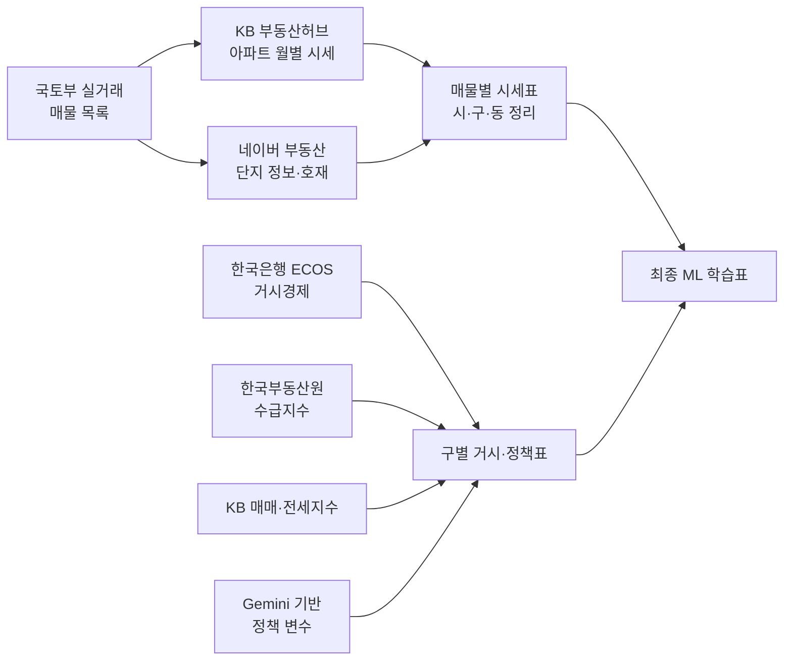

# 서울 아파트 시세 ML 데이터셋 — 작업 설명서

> 이 문서는 **비전공자도 이해할 수 있도록** 데이터가 어떻게 만들어졌는지, 그리고
> 각 컬럼이 **어떤 기준으로 숫자/등급으로 바뀌었는지**를 정리한 안내서입니다.

---

## 1. 한눈에 보기

서울시 아파트의 **월별 시세**를 중심으로, "이 아파트가 어떤 아파트인지(단지 특성)"와
"그 당시 경제·정책 상황이 어땠는지(거시 환경)"를 한 줄에 모아 놓은 **머신러닝 학습용 표**입니다.

- **분석 기간**: 2010년 1월 ~ 2026년 5월 (월 단위)
- **한 줄(행)의 의미**: "특정 아파트 + 특정 평형 + 특정 달"의 시세와 그 주변 정보
- **예측 목표(target)**: 그 달의 아파트 시세
- **최종 산출물**: 매물(아파트+평형)별로 1개의 CSV 파일 (시/구/동 폴더로 정리)
- **규모**: 약 5,973개 매물 파일 / 약 94.9만 행

---

## 2. 데이터는 이렇게 취득했습니다

여러 공공·민간 출처에서 데이터를 모아 하나로 합쳤습니다. 출처별 역할은 다음과 같습니다.

| 데이터 종류 | 내용 | 출처 |
|---|---|---|
| **검색 대상 매물** | 어떤 아파트를 조사할지 정하는 기준 목록 | **국토교통부 실거래 이력** |
| **아파트 시세** | 단지·평형별 월별 시세(예측 목표) | **KB 부동산허브** (크롤링) |
| **단지별 정보** | 준공년도·세대수·건설사·초등학교·인근역·호재 등 | **네이버 부동산** (크롤링) |
| **거시경제 변수** | 기준금리·물가·통화량·실업률 등 | **한국은행 ECOS** |
| **정책 변수** | LTV·DSR·투기과열·규제지역 등 | **Gemini 검색 결과 기반 생성** |
| **매매·전세 지수** (`reb__apt_sale_index`, `reb__apt_jeonse_index`) | 구별 가격지수 | **KB 부동산허브** |
| **수급 지수** (`reb__apt_..._supply_demand`) | 권역별 매수/매도 심리 | **한국부동산원(REB)** |

> 📌 **이름에 대한 참고**: 컬럼 접두사 `reb__` 가 붙어 있어도, **매매·전세 지수 2개는 실제로 KB 부동산허브**에서 가져온 값입니다.
> 접두사는 데이터 파이프라인 정리 과정에서 붙은 것으로, 실제 출처는 위 표를 기준으로 보시면 됩니다.

### 데이터 가공 흐름



---

## 3. 최종 표의 구조

한 행은 **"한 아파트의 한 평형이, 한 달에" 어땠는지**를 나타냅니다.
컬럼은 역할에 따라 이름 앞에 **꼬리표(접두사)** 가 붙어 있어, 보기만 해도 성격을 알 수 있습니다.

| 접두사 | 의미 | 시간에 따라 변하나? |
|---|---|---|
| `Header_` | 이 행이 "무엇"인지 알려주는 식별 정보 | 변하지 않음 |
| `target` | 예측 목표 = 시세 | **달마다 변함** |
| `Static__` | 아파트 고유 특성(등급화된 값) | 변하지 않음 |
| `depth1__` | 거시 변수 — **전국** 공통 | 달마다 변함 |
| `depth2__` | 거시 변수 — **권역**(서울 5개 권역) 단위 | 달마다 변함 |
| `depth3__` | 거시 변수 — **구(區)** 단위 | 달마다 변함 |

> `depth1 → depth2 → depth3` 은 "전국 → 권역 → 구" 로 **점점 좁은 지역**에 적용된다는 뜻입니다.
> 분석할 때 지역 단위별로 계층적으로 모델을 돌리기 쉽도록 일부러 이렇게 이름 붙였습니다.

---

## 4. 컬럼별 상세 — 어떤 로직으로 변환했나 (전체)

### 4-1. `Header_` — 식별 정보 (변환 없음, 원본 그대로)

| 컬럼 | 설명 |
|---|---|
| `Header_시` | 시 (예: 서울특별시) |
| `Header_구` | 구 (예: 송파구) |
| `Header_동` | 법정동 (예: 가락동) — KB 시세표의 '대표번지'에서 추출 |
| `Header_Timestamp` | 시세 기준 월 (매월 1일로 표기, 예: 2026-05-01) |
| `Header_단지명` | 아파트 단지명 |
| `Header_평형` | 전용면적(㎡) — 파일명/시세표의 '공급/전용면적'에서 추출 |

### 4-2. `target` — 예측 목표

| 컬럼 | 설명 |
|---|---|
| `target` | 그 달의 **시세(일반평균가, 단위: 만원)**. KB 시세표의 매매가 '일반평균가' 컬럼 값 |

### 4-3. `Static__` — 아파트 고유 특성 (등급/숫자로 변환)

여기가 핵심 가공 영역입니다. 원본 값을 **사람이 이해하기 쉬운 등급**이나 **개수**로 바꿨습니다.

| 컬럼 | 원본 데이터 | 변환 로직 (양자화·범주화) |
|---|---|---|
| `Static__준공구분` | 준공년도 | **2026년 기준 나이 계산** → **5년 이하 = 신축** / **5년 초과 ~ 10년 이하 = 준신축** / **10년 초과 = 구축** (년도 미상이면 공란) |
| `Static__세대수구분` | 단지 총 세대수 | **1,000세대 이상 = 대단지** / **500 ~ 999세대 = 중단지** / **500세대 미만 = 소단지** (미상이면 공란) |
| `Static__평수구분` | 전용면적(㎡) | **60㎡ 이하 = 소형** / **60㎡ 초과 ~ 85㎡ 이하 = 중형** / **85㎡ 초과 = 대형** |
| `Static__건설사등급` | 시공 건설사명 | **시공능력평가 순위 기반** → **1~10위 = 대형** / **11~50위 = 중형** / **51위 이하 및 명단에 없는 회사 = 소형** (상세 명단은 4-5 참고) |
| `Static__초품아여부` | 배정 초등학교 + 거리 | 초등학교가 있고 **가장 가까운 학교가 500m 이하**면 **"초품아"**, 아니면 공란 |
| `Static__역세권수` | 인근 지하철역 목록 | 주변에 표기된 **역 개수를 셈** (0, 1, 2, 3 …). 역 정보 없으면 **0** |
| `Static__호재수` | 철도호재 + 개발호재 | 두 종류 호재를 **합쳐서 개수를 셈** (0, 1, 2, 3 …). 없으면 **0** |

> 💡 **양자화 요약**: 준공·세대수·평형·건설사는 **3단계 등급**으로, 초품아는 **있음/없음**으로,
> 역세권·호재는 **개수(카운트)** 로 바꿨습니다.

### 4-4. `depth1 / depth2 / depth3` — 거시·정책 변수 (지역 단위별 결합)

이 변수들은 **아파트의 시/구와 그 달(Timestamp)에 맞춰** 가져다 붙였습니다.
즉, "강남구의 2020년 3월" 아파트 행에는 "강남구의 2020년 3월" 거시지표가 들어갑니다.
원래 수치형 지표라 **등급화하지 않고 원본 숫자를 그대로** 사용합니다.

#### depth1 — 전국 공통 (한국은행 ECOS)

| 컬럼 | 의미 |
|---|---|
| `depth1__ecos__base_rate` | 한국은행 기준금리 |
| `depth1__ecos__cd_91d_rate` | CD(양도성예금증서) 91일물 금리 |
| `depth1__ecos__cpi_housing` | 주택 관련 소비자물가지수 |
| `depth1__ecos__m2_avg` | 광의통화(M2) 평잔 |
| `depth1__ecos__mortgage_rate_new` | 신규취급 주택담보대출 금리 |
| `depth1__ecos__unemployment_rate` | 실업률 |

#### depth2 — 권역 단위 (한국부동산원 REB, 수급동향)

서울을 **5개 권역**(도심·동북·서북·서남·동남)으로 나눠 적용합니다.

| 컬럼 | 의미 |
|---|---|
| `depth2__reb__apt_sale_supply_demand` | 아파트 **매매** 수급지수(매수/매도 심리) |
| `depth2__reb__apt_jeonse_supply_demand` | 아파트 **전세** 수급지수 |
| `depth2__reb__apt_monthly_rent_supply_demand` | 아파트 **월세** 수급지수 |

#### depth3 — 구(區) 단위 (KB 지수 + 정책 변수)

| 컬럼 | 의미 | 출처 |
|---|---|---|
| `depth3__reb__apt_sale_index` | 구별 아파트 **매매가격지수** | KB 부동산허브 |
| `depth3__reb__apt_jeonse_index` | 구별 아파트 **전세가격지수** | KB 부동산허브 |
| `depth3__policy__ltv_tightness` | LTV(주택담보인정비율) 규제 강도 | Gemini 기반 생성 |
| `depth3__policy__dsr_severity` | DSR(총부채원리금상환비율) 규제 강도 | Gemini 기반 생성 |
| `depth3__policy__is_speculative` | 투기지역 여부 (1=해당) | Gemini 기반 생성 |
| `depth3__policy__is_overheated` | 투기과열지구 여부 (1=해당) | Gemini 기반 생성 |
| `depth3__policy__is_regulated` | 조정대상지역 등 규제지역 여부 (1=해당) | Gemini 기반 생성 |

### 4-5. 건설사 등급 분류 상세 명단

`Static__건설사등급` 은 시공능력평가 순위를 기준으로 다음과 같이 분류했습니다.
**회사명이 바뀐 경우(예: 대림산업 → 디엘이앤씨)도 같은 회사로 인식**하도록 처리했습니다.

- **대형 (1~10위)**: 삼성물산, 현대건설, 대우건설, 디엘이앤씨(=대림산업), 지에스건설,
  현대엔지니어링, 포스코이앤씨(=포스코건설), 롯데건설, 에스케이에코플랜트(=에스케이건설),
  에이치디씨현대산업개발(=현대산업개발)
- **중형 (11~50위)**: 한화, 호반건설, 디엘건설, 두산에너빌리티, 계룡건설, 서희건설, 제일건설,
  코오롱글로벌, 태영건설, 케이씨씨건설, 우미건설, 대방건설, 쌍용건설, 금호건설, 두산건설,
  한신공영, 효성중공업, 동부건설, 한라, 반도건설, 호반산업, 동원개발, 신세계건설 등 (총 40개사)
- **소형 (51위 이하 + 명단에 없는 모든 회사)**: 남광토건, 극동건설, 경남기업, 신동아건설,
  이수건설, 삼부토건 등 51~100위권 및 그 외 모든 건설사

> ⚠️ **주의**: 개별 회사 `(주)대림`(71위, 소형)과 `대림산업`(대형, 현 디엘이앤씨)은 **다른 회사**로,
> 이름이 비슷해도 등급이 다르게 분류됩니다.

---

## 5. 결측치(빈 값)는 어떻게 처리했나

- **시세가 없는 기간**: 아파트마다 시세 기록 시작 시점이 다릅니다(예: 2018년 준공 단지는 2018년부터만 존재).
  **시세가 실제로 있는 달에만** 행을 만들었습니다.
- **분석 기간 밖**: 2010년 1월 이전(2004~2009)과 2026년 6월 이후 데이터는 **제외**했습니다.
  (제외된 행 약 24만 건)
- **거시·정책 변수가 없는 경우**: 일부 초기 연도의 권역 수급지수 등은 원본 자체가 없어 **빈 칸(결측)** 으로 둡니다.
  값을 임의로 채우지 않았습니다.

---

## 6. 폴더 구조 (산출물 위치)

최종 데이터는 **시 → 구 → 동** 폴더 안에, **"단지명_전용면적.csv"** 형태로 저장됩니다.

```
meta_ml/output/
└── 서울특별시/
    └── 송파구/
        └── 가락동/
            ├── 헬리오시티_59.96.csv
            ├── 헬리오시티_84.98.csv
            └── ...
```

각 CSV는 그 매물의 **월별 시계열**(분석 기간 내)이며, 위에서 설명한 모든 컬럼을 포함합니다.

---

## 7. 활용 방향 (참고)

- **목표**: 베이스라인 모델로 큰 흐름을 예측한 뒤, CatBoost 같은 기법으로 **남은 오차(잔차)** 를 보정하는 파이프라인.
- **계층 구조**: `depth1/2/3` 접두사 덕분에 "전국 → 권역 → 구" 단위로 나눠서 분석하기 쉽습니다.
- **범주형 변수**: `Static__` 의 등급(신축/대단지/대형 등)은 CatBoost 같은 범주형 친화 모델에 바로 투입할 수 있습니다.
